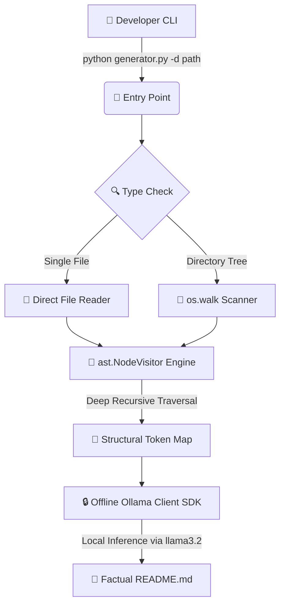

# Local-README Generator 🤖

An offline, privacy-first developer utility that leverages local Large Language Models (LLMs) and deep recursive Abstract Syntax Tree (AST) analysis to automatically compile enterprise-grade repository documentation.

---

## 🏗️ System Architecture & Overview

Unlike traditional documentation utilities that rely on fragile regular expressions (Regex) or expensive cloud API keys, this system executes deterministic static program analysis to optimize context mapping before handing off to a local inference pipeline.



### 1. Recursive Static Program Analysis
The engine implements a customized `ast.NodeVisitor` subclass to walk a compilation unit's tree structure recursively. This architectural pattern guarantees 100% traversal depth, catching deeply nested inner functions, class structures, method scopes, and docstrings cleanly without executing untrusted logic.

### 2. Line-Buffered Content Streaming
To read non-Python scripts safely, the system replaces naive character slicing with a hardened line-buffered reading method. By reading up to a fixed line boundary, the tool ensures data collection cuts off strictly on clear newline (`\n`) characters, eliminating malformed byte strings.

### 3. Data Integrity & Overwrite Gateways
A pre-flight defensive validation block guards the file storage system. If the generator detects a pre-existing documentation file at the targeted output path, it halts operation and triggers an explicit warning, requesting user clearance before writing data.

---

## 💻 Technical Stack

*   **Core Engine:** Python 3 standard library (`ast`, `argparse`, `threading`, `sys`, `os`)
*   **AI Orchestration:** Ollama Python SDK Client
*   **Inference Model:** Llama 3.2 (3B Parameters, running 100% locally and offline)
*   **Documentation Target:** GitHub Flavored Markdown (GFM)

---

## ⚙️ Installation & Environment Setup

Ensure your local machine has the Ollama background engine running before starting configuration:
```bash
ollama run llama3.2
```

### Setup Steps
1. Navigate to your project root folder:
   ```bash
   cd ~/Developer/readme-generator
   ```
2. Initialize and activate your isolated virtual environment sandbox:
   ```bash
   python3 -m venv venv
   source venv/bin/activate
   ```
3. Install the required client dependencies:
   ```bash
   pip install -r requirements.txt
   ```

---

## 🚀 Usage Guide

Always execute the application from within your active Python virtual environment sandbox (`venv`).

### Command Line Flags
*   `-d / --dir`: Path to the targeted directory structure or specific source file to analyze.
*   `-o / --output`: Redirection path to save the generated `README.md` file.
*   `-i / --interactive`: Enables user metadata configuration injection prompts.

### Production Syntax Examples

**Basic Automated Run (Current Directory):**
```bash
python generator.py -d .
```

**Targeting an Individual Script File:**
```bash
python generator.py -d /path/to/project/target_script.py
```

**Interactive Mode with Custom Output Targets:**
```bash
python generator.py -i -d /path/to/project -o /path/to/output_folder/
```
*Note: The interface features a fast conditional intercept. When asked `Do you want to enter custom project metadata? (y/n):`, typing `n` immediately skips the forms and launches automated AI rendering.*

---

## 📄 Open-Source License

This project is open-source and distributed under the terms of the **MIT License**.
