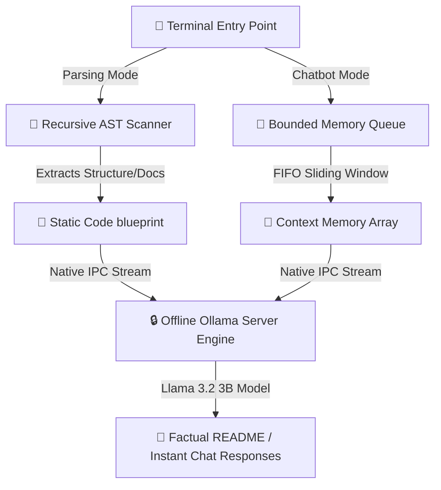

# Local-README Generator & Developer Assistant Suite 🤖💬

An offline, privacy-first command-line utility that integrates deterministic static code analysis with real-time interactive AI chat environments leveraging local Large Language Models (LLMs).

---

## 🏗️ Dual-Engine Architecture Overview

This platform operates as a multi-mode command-line tool. It decouples high-throughput static tree parsing from dynamic conversational state-tracking loops, piping structured payloads to a localized inference machine.



### 1. Mode A: Deterministic Static Code Analysis
The analysis layer maps out systems architecture cleanly using Python's native `ast.NodeVisitor`. It traverses code bases recursively to map class definitions, function signatures, and lexical docstrings without executing untrusted compiler components. Non-Python configurations stream via a line-buffered reader to keep data allocations completely boundary-safe.

### 2. Mode B: Sliding-Window Conversational State Memory
The interactive chatbot core bypasses RAM context wind-up using a bounded First-In-First-Out (FIFO) sliding-window ring buffer. When conversations exceed target constraints, the queue drops the oldest Q&A pair while anchoring the initial system rules, keeping model performance incredibly fast.

### 3. Non-Blocking Multithreaded UI
Synchronous model inference processing is separated from your host machine console window using primitive `threading` routines. This allows a frames-per-second stable daemon animation (`loading_animation`) to loop smoothly alongside generation.

---

## 💻 Technical Infrastructure Profile

*   **Core Systems Platform:** Python 3 standard library (`ast`, `argparse`, `threading`, `sys`, `os`, `time`)
*   **Local AI Framework Orchestration:** Ollama Python SDK Client Core
*   **Host Inference Deep Learning Model:** Llama 3.2 (3-Billion Parameter Model running completely offline)
*   **Secure Audit Trail Component:** Local Session File Serializer (`.ai_chat_history/`)

---

## ⚙️ Installation & Environment Sandbox Setup

Ensure your host operating system has the Ollama service running natively before launching setup:
```bash
ollama run llama3.2
```

### Repository Setup
1. Clone or clone your files into your active working directory:
   ```bash
   cd ~/Developer/readme-generator
   ```
2. Initialize and activate an isolated virtual environment sandbox:
   ```bash
   python3 -m venv venv
   source venv/bin/activate
   ```
3. Install the required external execution packages:
   ```bash
   pip install -r requirements.txt
   ```

---

## 🚀 Precise Multi-Mode Usage Guide

Always execute the application from within your active Python virtual environment sandbox (`venv`).

### 📝 Mode 1: Repository Documentation Generator

Execute the application with path inputs to run structural analysis pipelines:

```bash
# Scan a directory structure or individual file path automatically
python generator.py -d /path/to/target

# Execute inside interactive metadata configuration mapping mode
python generator.py -i -d .

# Redirect your final generated documentation file to a different folder
python generator.py -d . -o /path/to/output_directory/
```

### 💬 Mode 2: Bounded Terminal AI Chatbot

Add the `-c` or `--chat` switch to bypass the folder scanner and launch the interactive chatbot container console immediately:

```bash
python generator.py --chat
```

*   **Persistent Local Logging:** Your text sessions are automatically serialized into timestamped files inside the hidden `.ai_chat_history/` directory.
*   **Console Shortcuts:** Type `clear` to scrub the conversational window memory, or type `exit` / `quit` to return back to your terminal framework safely.

---

## 📄 Open-Source License

This project architecture is distributed completely free under the **MIT License**.
